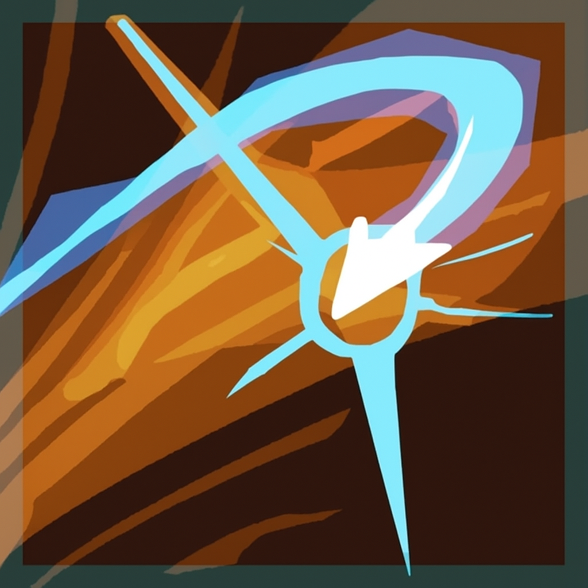
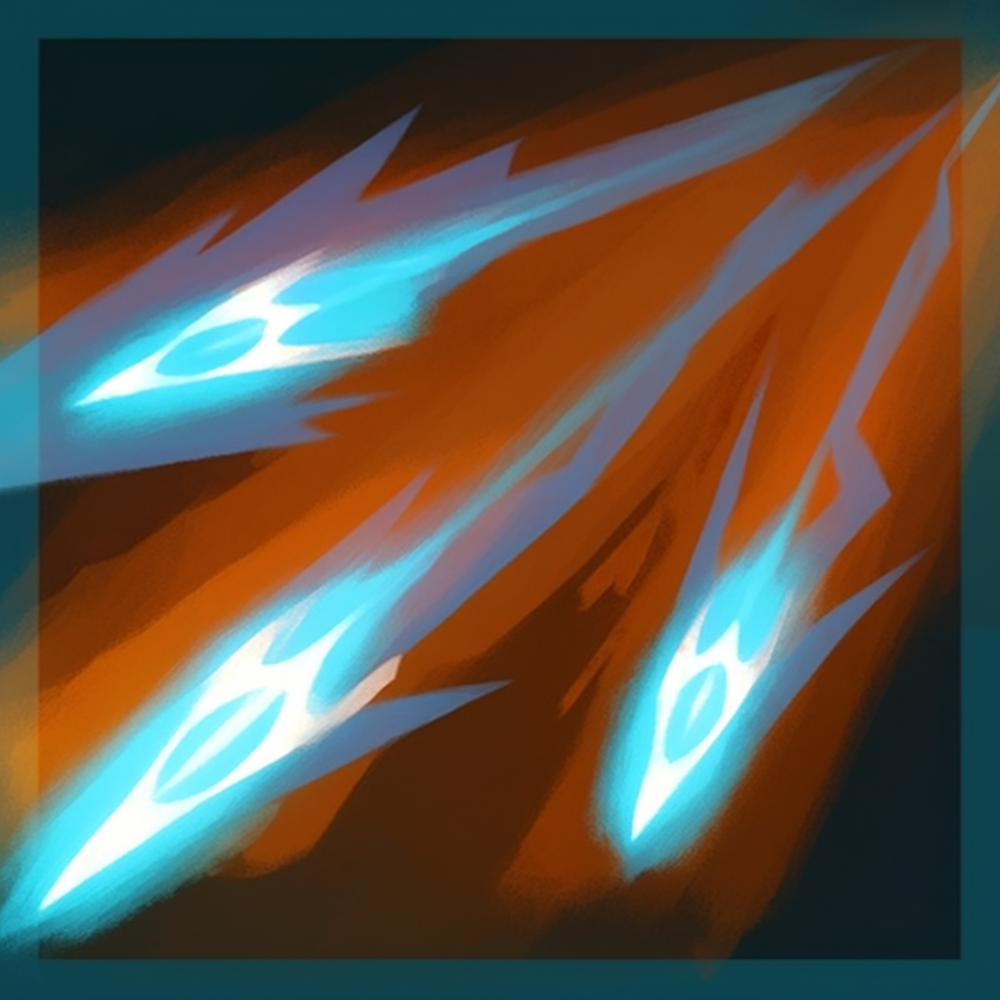

# MoreHuntressSkills
A mod for Risk of Rain 2 that adds new abilities to Huntress, including a primary, secondary, utility and special ability.

These are the skills implemented:

|   |   |   |
|---|---|
|  | TranceFire |Agile. Fire a seeking arrow for 100% damage. Firing it continously without recieving damage gain a charge of Focus increasing the ability speed until a maximum of 10. At max Focus fire 2 arrows instead of 2.|
|  | SplittingGlaive |Fire a boomerang for 460% damage. After collision it divides into 2 dealing 70% of the original damage up to 3 times.|
|  | StalkingThePrey |Agile. Become Invisible, make next ability Critical and gain movement speed until a damage ability is used. Upon use, increases Critical Damage by 30% and grants 25% Critical Chance.|
|  | SwiftManeuver |Agile, Dissapear and teleport a short distance, then shot an arrow for 750% damage, then, teleport again and shot another arrow for 750% damage. Can store up to 2 charges.Critical Strikes reduce cooldown by 3 seconds.|

### TO DO LIST
---
&#9633; Balancing the mod.

&#9633; Make new icons for the abilities and buffs.

&#9633; Make custom animations. 

&#9633; Test the mod in multiplayer.

